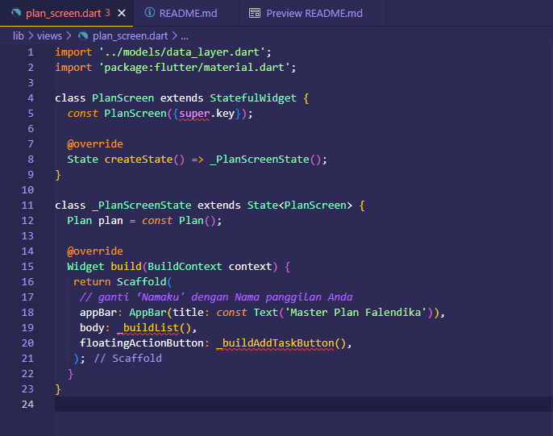
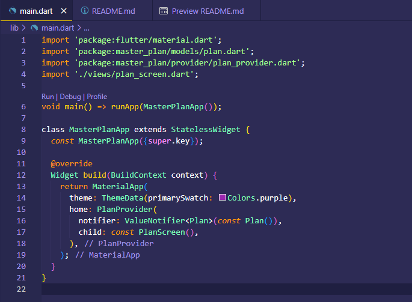

 

  <h3 align="center">PEMROGRAMAN MOBILE</h3>
    
  
    
  <h3 align="center">Falendika Tegar Pratama</h3>
  <h3 align="center">3G - D4TI</h3>
  <h3 align="center">2141720107</h3>

 

<h1 align="center">Laporan Praktikum Minggu Ke-12</h1>

 

<!-- ABOUT THE PROJECT -->
# Praktikum 1: Dasar State dengan Model-View

Selesaikan langkah-langkah praktikum berikut ini menggunakan editor Visual Studio Code (VS Code) atau Android Studio atau code editor lain kesukaan Anda.

### Langkah 1: Buat Project Baru

Buatlah sebuah project flutter baru dengan nama master_plan di folder src week-11 repository GitHub Anda. Lalu buatlah susunan folder dalam project seperti gambar berikut ini.

 

### Langkah 2: Membuat model task.dart

Praktik terbaik untuk memulai adalah pada lapisan data (data layer). Ini akan memberi Anda gambaran yang jelas tentang aplikasi Anda, tanpa masuk ke detail antarmuka pengguna Anda. Di folder model, buat file bernama task.dart dan buat class Task. Class ini memiliki atribut description dengan tipe data String dan complete dengan tipe data Boolean, serta ada konstruktor. Kelas ini akan menyimpan data tugas untuk aplikasi kita. Tambahkan kode berikut:

 

### Langkah 3: Buat file plan.dart

Kita juga perlu sebuah List untuk menyimpan daftar rencana dalam aplikasi to-do ini. Buat file plan.dart di dalam folder models dan isi kode seperti berikut.

 

### Langkah 4: Buat file data_layer.dart

Kita dapat membungkus beberapa data layer ke dalam sebuah file yang nanti akan mengekspor kedua model tersebut. Dengan begitu, proses impor akan lebih ringkas seiring berkembangnya aplikasi. Buat file bernama data_layer.dart di folder models. Kodenya hanya berisi export seperti berikut.

 

### Langkah 5: Pindah ke file main.dart

Ubah isi kode main.dart sebagai berikut.

 

### Langkah 6: buat plan_screen.dart

Pada folder views, buatlah sebuah file plan_screen.dart dan gunakan templat StatefulWidget untuk membuat class PlanScreen. Isi kodenya adalah sebagai berikut. Gantilah teks ‘Namaku' dengan nama panggilan Anda pada title AppBar.

 

### Langkah 7: buat method _buildAddTaskButton()

Anda akan melihat beberapa error di langkah 6, karena method yang belum dibuat. Ayo kita buat mulai dari yang paling mudah yaitu tombol Tambah Rencana. Tambah kode berikut di bawah method build di dalam class _PlanScreenState.

 

### Langkah 8: buat widget _buildList()

Kita akan buat widget berupa List yang dapat dilakukan scroll, yaitu ListView.builder. Buat widget ListView seperti kode berikut ini.

 

### Langkah 9: buat widget _buildTaskTile

Dari langkah 8, kita butuh ListTile untuk menampilkan setiap nilai dari plan.tasks. Kita buat dinamis untuk setiap index data, sehingga membuat view menjadi lebih mudah. Tambahkan kode berikut ini.

 

Run atau tekan F5 untuk melihat hasil aplikasi yang Anda telah buat. Capture hasilnya untuk soal praktikum nomor 4.

 

### Langkah 10: Tambah Scroll Controller

Anda dapat menambah tugas sebanyak-banyaknya, menandainya jika sudah beres, dan melakukan scroll jika sudah semakin banyak isinya. Namun, ada salah satu fitur tertentu di iOS perlu kita tambahkan. Ketika keyboard tampil, Anda akan kesulitan untuk mengisi yang paling bawah. Untuk mengatasi itu, Anda dapat menggunakan ScrollController untuk menghapus focus dari semua TextField selama event scroll dilakukan. Pada file plan_screen.dart, tambahkan variabel scroll controller di class State tepat setelah variabel plan.

 

### Langkah 11: Tambah Scroll Listener

Tambahkan method initState() setelah deklarasi variabel scrollController seperti kode berikut.

 

### Langkah 12: Tambah controller dan keyboard behavior

Tambahkan controller dan keyboard behavior pada ListView di method _buildList seperti kode berikut ini.

 

### Langkah 13: Terakhir, tambah method dispose()

Terakhir, tambahkan method dispose() berguna ketika widget sudah tidak digunakan lagi.

 

### Langkah 14: Hasil

Lakukan Hot restart (bukan hot reload) pada aplikasi Flutter Anda. Anda akan melihat tampilan akhir seperti gambar berikut. Jika masih terdapat error, silakan diperbaiki hingga bisa running.

 

# Tugas Praktikum 1: Dasar State dengan Model-View

 

## Jelaskan maksud dari langkah 4 pada praktikum tersebut! Mengapa dilakukan demikian?

Langkah 4 berfungsi untuk mengekspor kode pada plan.dart dan task.dart sehingga pada plan_screen.dart hanya mengimport file data_layer.dart saja untuk mengimpor kedua file tersebut.

 

## Mengapa perlu variabel plan di langkah 6 pada praktikum tersebut? Mengapa dibuat konstanta ?

- Variabel plan digunakan untuk menginisialisasikan class Plan yang telah dibuat pada plan.dart. 
- Konstanta digunakan agar variabel tersebut tidak dapat diubah nilainya.

 

## Lakukan capture hasil dari Langkah 9 berupa GIF, kemudian jelaskan apa yang telah Anda buat!

 

Penjelasan : Pembuatan todo list app yang dapat menambahkan task dan melakukan checklist pada task yang sudah ditambahkan.

 

## Apa kegunaan method pada Langkah 11 dan 13 dalam lifecyle state ?

- Fungsi initstate digunakan untuk menginisialisasi state pada widget. 
- Fungsi dispose digunakan untuk membersihkan state pada widget.

 

# Praktikum 2: Mengelola Data Layer dengan InheritedWidget dan InheritedNotifier

Bagaimana seharusnya Anda mengakses data pada aplikasi?

Beberapa pilihan yang bisa dilakukan adalah meletakkan data dalam satu kelas yang sama sehingga menjadi bagian dari life cycle aplikasi Anda.

Kemudian muncul pertanyaan, bagaimana meletakkan model dalam pohon widget ? sedangkan model bukanlah widget, sehingga tidak akan tampil pada screen.

Solusi yang memungkinkan adalah menggunakan InheritedWidget. Sejauh ini kita hanya menggunakan dua jenis widget, yaitu StatelessWidget dan StatefulWidget. Kedua widget tersebut digunakan untuk layouting UI di screen. Di mana satu bersifat statis dan dinamis. Sedangkan InheritedWidget itu berbeda, ia dapat meneruskan data ke sub-widget turunannya (biasanya ketika Anda menerapkan decomposition widget). Jika dilihat dari perspektif user, itu tidak akan terlihat prosesnya (invisible). InheritedWidget dapat digunakan sebagai pintu untuk komunikasi antara view dan data layers.

Pada codelab ini, kita akan memperbarui kode dari aplikasi Master Plan dengan memisahkan data todo list ke luar class view-nya.

Setelah Anda menyelesaikan praktikum 1, Anda dapat melanjutkan praktikum 2 ini. Selesaikan langkah-langkah praktikum berikut ini menggunakan editor Visual Studio Code (VS Code) atau Android Studio atau code editor lain kesukaan Anda.

### Langkah 1: Buat file plan_provider.dart

Buat folder baru provider di dalam folder lib, lalu buat file baru dengan nama plan_provider.dart berisi kode seperti berikut.

 

### Langkah 2: Edit main.dart

Gantilah pada bagian atribut home dengan PlanProvider seperti berikut. Jangan lupa sesuaikan bagian impor jika dibutuhkan.

 

### Langkah 3: Tambah method pada model plan.dart

Tambahkan dua method di dalam model class Plan seperti kode berikut.

 

### Langkah 4: Pindah ke PlanScreen

Edit PlanScreen agar menggunakan data dari PlanProvider. Hapus deklarasi variabel plan (ini akan membuat error). Kita akan perbaiki pada langkah 5 berikut ini.

<!--  -->

 

### Langkah 5: Edit method _buildAddTaskButton

Tambahkan BuildContext sebagai parameter dan gunakan PlanProvider sebagai sumber datanya. Edit bagian kode seperti berikut.

 

### Langkah 6: Edit method _buildTaskTile

Tambahkan parameter BuildContext, gunakan PlanProvider sebagai sumber data. Ganti TextField menjadi TextFormField untuk membuat inisial data provider menjadi lebih mudah.

 

### Langkah 7: Edit _buildList

Sesuaikan parameter pada bagian _buildTaskTile seperti kode berikut.

 

### Langkah 8: Tetap di class PlanScreen

Edit method build sehingga bisa tampil progress pada bagian bawah (footer). Caranya, bungkus (wrap) _buildList dengan widget Expanded dan masukkan ke dalam widget Column seperti kode pada Langkah 9.

 

### Langkah 9: buat widget _buildTaskTile

Dari langkah 8, kita butuh ListTile untuk menampilkan setiap nilai dari plan.tasks. Kita buat dinamis untuk setiap index data, sehingga membuat view menjadi lebih mudah. Tambahkan kode berikut ini.

 

Akhirnya, run atau tekan F5 jika aplikasi belum running. Tidak akan terlihat perubahan pada UI, namun dengan melakukan langkah-langkah di atas, Anda telah menerapkan cara memisahkan dengan baik antara view dan model. Ini merupakan hal terpenting dalam mengelola state di aplikasi Anda.

#### Hasil Output

 

# Tugas Praktikum 2: InheritedWidget

 

## Jelaskan mana yang dimaksud InheritedWidget pada langkah 1 tersebut! Mengapa yang digunakan InheritedNotifier?

InheritedWidget adalah widget yang dapat digunakan untuk mengakses data dari widget lainnya. InheritedNotifier digunakan untuk mengakses data dari widget lainnya dan dapat memberitahu widget lainnya jika terjadi perubahan data.

 

## Jelaskan maksud dari method di langkah 3 pada praktikum tersebut! Mengapa dilakukan demikian?

Fungsi completedCount pada langkah 3 digunakan untuk mendapatkan jumlah task yang sudah selesai. Sedangkan fungsi completenessMessage digunakan untuk menampilkan teks taks yang sudah selesai.

 

## Lakukan capture hasil dari Langkah 9 berupa GIF, kemudian jelaskan apa yang telah Anda buat!

 

Penjelasan : Menggunakan widget safeArea untuk menampilkan jumlah task yang sudah selesai pada bagian bawah.

 

# Praktikum 3: Membuat State di Multiple Screens

Satu kalimat populer atau viral yang beredar dalam komunitas Flutter adalah "Lift State Up". Mantra ini merujuk ke sebuah ide di mana objek State seharusnya berada lebih tinggi dari pada widget yang membutuhkannya di dalam sebuah widget tree. InheritedWidget yang telah kita buat sebelumnya bekerja dengan sempurna pada satu screen, tapi apa yang akan terjadi jika kita tambah screen kedua ?

Pada codelab ini, Anda akan menambah screen lain pada aplikasi Master Plan sehingga bisa membuat kelompok daftar plan lebih dari satu.

Selesaikan langkah-langkah praktikum berikut ini menggunakan editor Visual Studio Code (VS Code) atau Android Studio atau code editor lain kesukaan Anda.

### Langkah 1: Edit PlanProvider

Perhatikan kode berikut, edit class PlanProvider sehingga dapat menangani List Plan.

 

### Langkah 2: Edit main.dart

Langkah sebelumnya dapat menyebabkan error pada main.dart dan plan_screen.dart. Pada method build, gantilah menjadi kode seperti ini.

 

### Langkah 3: Edit plan_screen.dart

Tambahkan variabel plan dan atribut pada constructor-nya seperti berikut.

 

### Langkah 4: Error

Itu akan terjadi error setiap kali memanggil PlanProvider.of(context). Itu terjadi karena screen saat ini hanya menerima tugas-tugas untuk satu kelompok Plan, tapi sekarang PlanProvider menjadi list dari objek plan tersebut.

<!--  -->

 

### Langkah 5: Tambah getter Plan

Tambahkan getter pada _PlanScreenState seperti kode berikut.

 

### Langkah 6: Method initState()

Pada bagian ini kode tetap seperti berikut.

 

### Langkah 7: Widget build

Pastikan Anda telah merubah ke List dan mengubah nilai pada currentPlan seperti kode berikut ini.

 

### Langkah 8: Edit _buildTaskTile

Pastikan ubah ke List dan variabel planNotifier seperti kode berikut ini.

 

### Langkah 9: Buat screen baru

Pada folder view, buatlah file baru dengan nama plan_creator_screen.dart dan deklarasikan dengan StatefulWidget bernama PlanCreatorScreen. Gantilah di main.dart pada atribut home menjadi seperti berikut.

 

### Langkah 10: Pindah ke class _PlanCreatorScreenState

Kita perlu tambahkan variabel TextEditingController sehingga bisa membuat TextField sederhana untuk menambah Plan baru. Jangan lupa tambahkan dispose ketika widget unmounted seperti kode berikut.

 

### Langkah 11: Pindah ke method build

Letakkan method Widget build berikut di atas void dispose. Gantilah ‘Namaku' dengan nama panggilan Anda.

 

### Langkah 12: Buat widget _buildListCreator

Buatlah widget berikut setelah widget build.

 

### Langkah 13: Buat void addPlan()

Tambahkan method berikut untuk menerima inputan dari user berupa text plan.

 

### Langkah 14: Buat widget _buildMasterPlans()

Dari langkah 8, kita butuh ListTile untuk menampilkan setiap nilai dari plan.tasks. Kita buat dinamis untuk setiap index data, sehingga membuat view menjadi lebih mudah. Tambahkan kode berikut ini.

 

Terakhir, run atau tekan F5 untuk melihat hasilnya jika memang belum running. Bisa juga lakukan hot restart jika aplikasi sudah running. Maka hasilnya akan seperti gambar berikut ini.

#### Hasil Output

 

# Tugas Praktikum 3: State di Multiple Screens

 

## Berdasarkan Praktikum 3 yang telah Anda lakukan, jelaskan maksud dari gambar diagram berikut ini!

 

Penjelasan :

Gambar diagram diatas adalah representasi visual dari struktur kode dalam pengembangan aplikasi menggunakan framework Flutter. Di bawah ini adalah penjelasannya:

- MaterialApp, PlanProvider, dan PlanCreatorScreen: Di sebelah kiri, ada struktur biru yang dimulai dengan “MaterialApp”, diikuti oleh “PlanProvider”, “PlanCreatorScreen”, dan elemen-elemen lainnya seperti “Column”, “TextField”, “Expanded”, dan “ListView”.
- Navigator Push: Ada panah besar dengan label “Navigator Push” yang mengarah ke struktur hijau di sebelah kanan. Ini menunjukkan transisi atau perubahan dari satu layar atau tampilan aplikasi ke layar atau tampilan lain.
- MaterialApp dan PlanScreen: Struktur hijau di sebelah kanan dimulai dengan “MaterialApp”, diikuti oleh “PlanScreen”, “Scaffold”, dan elemen-elemen lainnya seperti “Column”, “Expanded”, “SafeArea”, “ListView”, dan “Text”.

Secara keseluruhan, diagram ini menjelaskan alur navigasi dan struktur tata letak dalam pengembangan aplikasi. Menunjukkan bagaimana komponen-komponen berinteraksi dan berubah melalui proses “Navigator Push”.

 

## Lakukan capture hasil dari Langkah 14 berupa GIF, kemudian jelaskan apa yang telah Anda buat!

Penjelasan :

Membuat aplikasi untuk merencanakan tugas yang akan diselesaikan dengan aplikasi ini user bisa memanage tugas-tugas yang ingin diselesaikan dan memonitor apakah tugas tersebut sudah diselesaikan atau belum dengan melakukan checklist, maka dari itu ada informasi seperti "0 out of 1 tasks" yang menandakan bahwa user mengerjakan 0 tugas dari 1 tugas yang ada.

 

